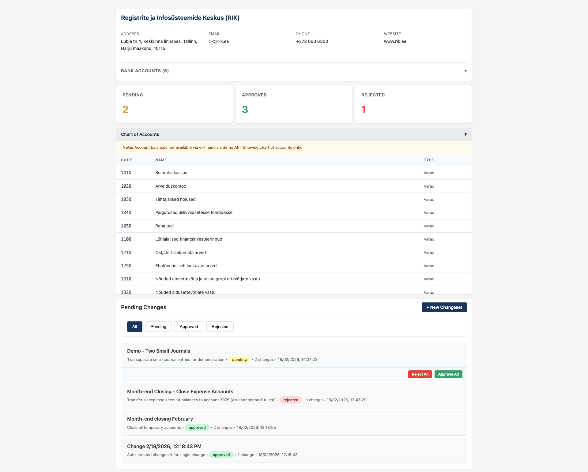
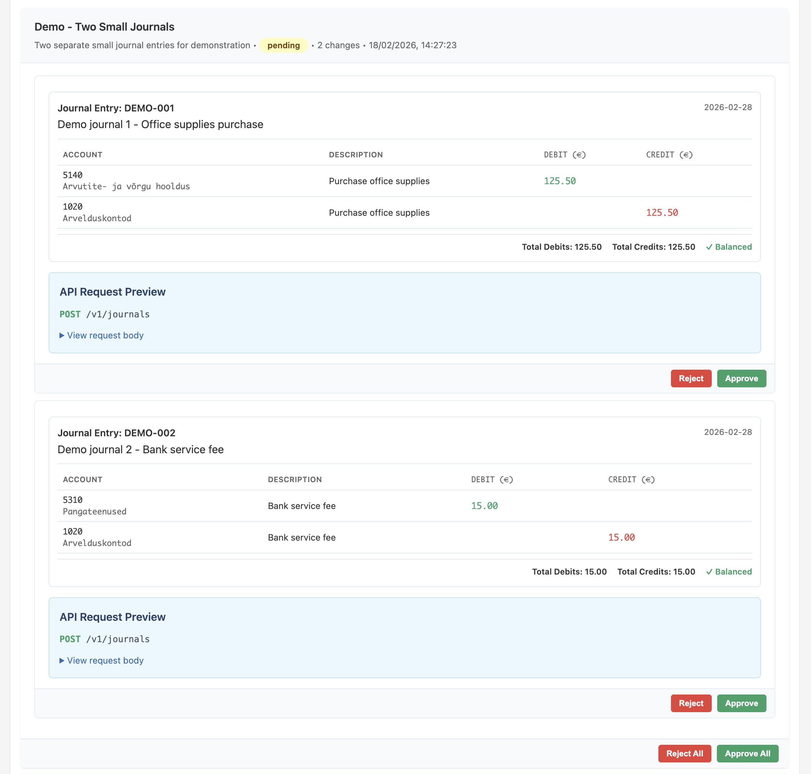

# e-arveldaja Proxy

A safety layer proxy for Estonian e-Financials (e-arveldaja) API that allows AI agents to freely read bookkeeping data while capturing all write operations for human approval.

**Key Principle**: AI agents can READ and PROPOSE changes, but cannot EXECUTE changes without human approval.

[](https://opensource.org/licenses/MIT)

## Features

- **Read-Only by Default**: AI agents can freely query all data (accounts, journals, transactions, invoices)
- **Write Protection**: All POST/PATCH/PUT/DELETE operations are captured and queued for approval
- **Beautiful UI**: Web interface with specialized visualization for double-entry bookkeeping
- **MCP Server**: AI assistants can interact through Model Context Protocol
- **Audit Trail**: Complete history of all proposed and executed changes
- **Secure**: HMAC-SHA-384 authentication compatible with e-Financials API

## Screenshots

### Main Dashboard
Overview of company info, account balances, and all pending changes with their status.



### Pending Changeset Review
Detailed view of journal entries awaiting approval, showing account codes, names, and debit/credit amounts.



## Quick Start

### 1. Install dependencies

```bash
npm install
```

### 2. Configure environment variables

Create a `.env` file:

```env
API_KEY_ID=your_api_key_id
API_KEY_PUBLIC=your_api_key_public
API_KEY_PASSWORD=your_api_key_password
API_BASE_URL=https://demo-rmp-api.rik.ee/v1
PORT=3000
```

### 3. Build and run

```bash
npm run build
npm run dev
```

The server will start on port 3000 (or PORT env var).

**Access points:**
- Web UI: http://localhost:3000/review
- Health check: http://localhost:3000/health

## Documentation

- **[USAGE.md](USAGE.md)** - Complete usage guide for humans (installation, configuration, common tasks, troubleshooting)
- **[AGENTS.md](AGENTS.md)** - Instructions for AI assistants working with this project
- **[API Documentation](#api-endpoints)** - API reference below

## How It Works

### Architecture

```
AI Agent/Client → Proxy → [If GET] → e-Financials API
                       → [If WRITE] → SQLite Queue → Web UI → User Approval
                                                            ↓
                                                 [If Approved] → e-Financials API
```

### The Safety Model

1. **Read Operations** (`GET` requests): Pass through directly to the e-Financials API
2. **Write Operations** (`POST/PUT/PATCH/DELETE`): Captured in SQLite, queued for approval
3. **Human Review**: Use the web UI at `/review` to approve or reject changes
4. **Execution**: Only approved changes are sent to the actual e-Financials API

## Usage Examples

### For Humans (Web UI)

Open http://localhost:3000/review to:
- See all pending changes with journal entry visualization
- Approve or reject individual changes
- Approve or reject entire changesets
- Delete individual changesets or bulk-delete filtered changesets
- View executed changes and their results

### For AI Agents (MCP Server)

AI assistants use the MCP server to interact safely:

**Reading data:**
```
query_api with endpoint: "/accounts"
```

**Proposing changes:**
```
propose_change:
  endpoint: "/journals"
  method: "POST"
  body: {
    "no": "J-2024-001",
    "effective_date": "2024-01-15",
    "description": "Office supplies",
    "transactions": [
      {"debit_account": "5140", "credit_account": "1020", "amount": "125.50"}
    ]
  }
  description: "Record office supplies purchase"
```

**Checking status:**
```
list_pending_changes
```

See [AGENTS.md](AGENTS.md) for complete AI assistant guidelines.

## MCP Server Setup

### Using with Claude Desktop

Add to `~/Library/Application Support/Claude/claude_desktop_config.json`:

```json
{
  "mcpServers": {
    "arveldaja": {
      "command": "node",
      "args": ["/full/path/to/arveldaja-proxy/dist/mcp-server.js"],
      "env": {
        "API_KEY_ID": "your_api_key_id",
        "API_KEY_PUBLIC": "your_api_key_public",
        "API_KEY_PASSWORD": "your_api_key_password"
      }
    }
  }
}
```

### MCP Tools Available

**Reading:**
- `query_api` - Query any e-Financials endpoint

**Proposing:**
- `propose_change` - Propose changes (captured, not executed)

**Checking:**
- `list_pending_changes` - See awaiting changes
- `list_changesets` - View all changesets
- `get_changeset_details` - Review specific changeset

## API Endpoints

### Proxy Endpoints

- `GET /proxy/v1/*` - Forward read requests to e-Financials
- `POST/PATCH/PUT/DELETE /proxy/v1/*` - Capture write requests

Example:
```bash
# Read accounts (passes through)
curl http://localhost:3000/proxy/v1/accounts

# Create journal (captured)
curl -X POST http://localhost:3000/proxy/v1/journals \
  -H "Content-Type: application/json" \
  -d '{
    "no": "J-001",
    "effective_date": "2024-01-15",
    "description": "Test entry",
    "transactions": [
      {"debit_account": "5140", "credit_account": "1020", "amount": "100.00"}
    ]
  }'
```

### Management API

- `GET /api/changes` - List all changes
- `GET /api/changes/:id` - Get specific change
- `POST /api/changes/:id/approve` - Approve and execute
- `POST /api/changes/:id/reject` - Reject change
- `GET /api/changesets` - List changesets
- `GET /api/changesets/:id` - Get changeset with changes
- `POST /api/changesets/:id/approve` - Approve all in changeset
- `DELETE /api/changesets/:id` - Delete one changeset and its captured changes
- `DELETE /api/changesets` - Delete all changesets (optional `?status=pending|approved|rejected`)
- `GET /api/stats` - Get statistics

### Journal payload behavior

- For `/journals` writes, the proxy converts simplified `transactions` to API `postings`.
- If a journal payload contains `description` but no `title`, the proxy automatically sets `title = description` so the journal description is visible in e-Financials.

### UI Routes

- `GET /review` - Review interface
- `GET /health` - Health check

## Scripts

```bash
npm run build      # Compile TypeScript
npm run dev        # Run with hot reload
npm start          # Run production build
npm run mcp        # Run MCP server
npm run lint       # Run ESLint
npm run typecheck  # Run TypeScript check
```

## Project Structure

```
src/
├── index.ts              # Main Express server
├── mcp-server.ts         # MCP server for AI agents
├── db/
│   └── index.ts          # SQLite database operations
├── middleware/
│   └── capture.ts        # Request interception middleware
├── routes/
│   ├── api.ts            # Change management API
│   ├── changesets.ts     # Changeset management API
│   └── company.ts        # Company info aggregation
└── utils/
    ├── auth.ts           # HMAC-SHA-384 signing
    └── executor.ts       # Execute approved changes
```

## Security

- **API Credentials**: Stored in environment variables, never exposed
- **Approval Required**: All writes require explicit human approval
- **Audit Trail**: Complete history stored in SQLite
- **No Secrets Logged**: Credentials never appear in logs

## License

MIT License - see LICENSE file for details.

## Support

- **Documentation**: See [USAGE.md](USAGE.md) and [AGENTS.md](AGENTS.md)
- **Issues**: https://github.com/yourusername/arveldaja-proxy/issues
